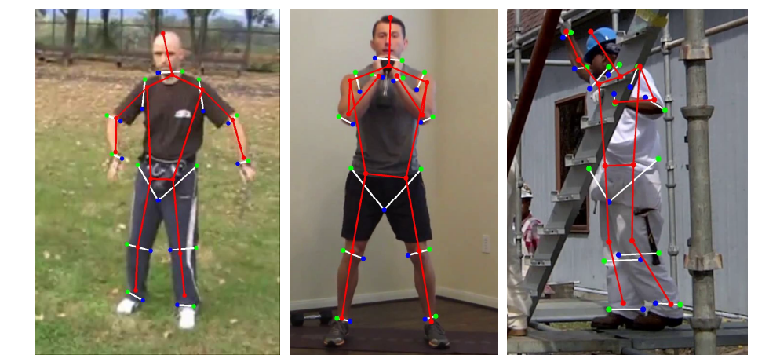

# Triplet-Representation-of-human-Body

This repo is for paper "TRB: A Novel Triplet Representation for 2D Human Human Body Understanding".

### What is TRB? 

- TRB is a novel 2D Human Body Representation we designed, which contains both 2D human skeleton and contour, in the form of skeleton keypoints and contour keypoints. We use points defined in current 2D pose estimation dataset as skeleton keypoints. For each skeleton keypoint, two contour points located on human boundary are defined as contour keypoints, the three keypoints form a triplet.

- In TRB definition, contour keypoints are divided into medial points and lateral points, corresponding to their relative position. In the demonstration below,  red, blue, green points denote skeleton points, medial contour points, lateral contour points respectively.

### What can TRB be used for? 

#### Auxiliary supervision for skeleton keypoints estimation

- We try to use TRB as supervision for skeleton keypoint estimation task. When combined with TRB-Net, we get significant improvement over the baseline. On MPII and LSP, we use paper [A Cascaded Inception of Inception Network with AttentionModulated Feature Fusion for Human Pose Estimation](https://www.aaai.org/ocs/index.php/AAAI/AAAI18/paper/viewFile/17206/16309) as our baseline. On COCO, we use 2-stack hourglass as our baseline.

- On LSP Dataset (threshold PCK@0.2):

  | LSP Test | Head | Shoulder | Elbow | Wrist | HIp  | Knee | Ankle | Mean |
  | -------- | ---- | -------- | ----- | ----- | ---- | ---- | ----- | ---- |
  | Baseline | 98.1 | 94.0     | 91.0  | 89.0  | 93.4 | 95.2 | 94.4  | 93.6 |
  | with TRB | 98.5 | 95.3     | 92.6  | 90.6  | 93.8 | 95.8 | 95.5  | 94.5 |

- On MPII Dataset (threshold PCKh@0.5):

  | MPII Test | Head | Shoulder | Elbow | Wrist | HIp  | Knee | Ankle | Mean |
  | --------- | ---- | -------- | ----- | ----- | ---- | ---- | ----- | ---- |
  | Baseline  | 98.4 | 96.4     | 92.0  | 87.8  | 90.7 | 88.3 | 85.3  | 91.6 |
  | with TRB  | 98.5 | 96.6     | 92.6  | 88.3  | 91.6 | 89.2 | 86.5  | 92.2 |

- On COCO Dataset (Half human instances are annotated with TRB, using detected bbox)

  | COCO Val | AP   | AP50 | AP75 | APM | APL |
  | -------- | ---- | --------------- | --------------- | -------------- | -------------- |
  | Baseline | 71.9 | 88.9            | 78.4            | 68.7           | 77.2           |
  | with TRB | 73.6 | 89.6            | 80.3            | 70.1           | 79.0           |

#### Shape guided human image generation

- TRB can be used as guidance for pose and shape guided human image generation. We show some examples below, in which we change contour points location to manipulate generated human shape.

  | Leg Editing                  | Shoulder Editing                   | Torso Editing                    |
  | ---------------------------- | ---------------------------------- | -------------------------------- |
  |  |  |  |

### MPII-TRB Data Format

- File 'MPII_contour_points.json' contains contour keypoints annotation for MPII train-val. It can be aligned with MPII dataset using image name and human center, to construct the MPII-TRB dataset.

### TODO

- [X] MPII-trb dataset release
